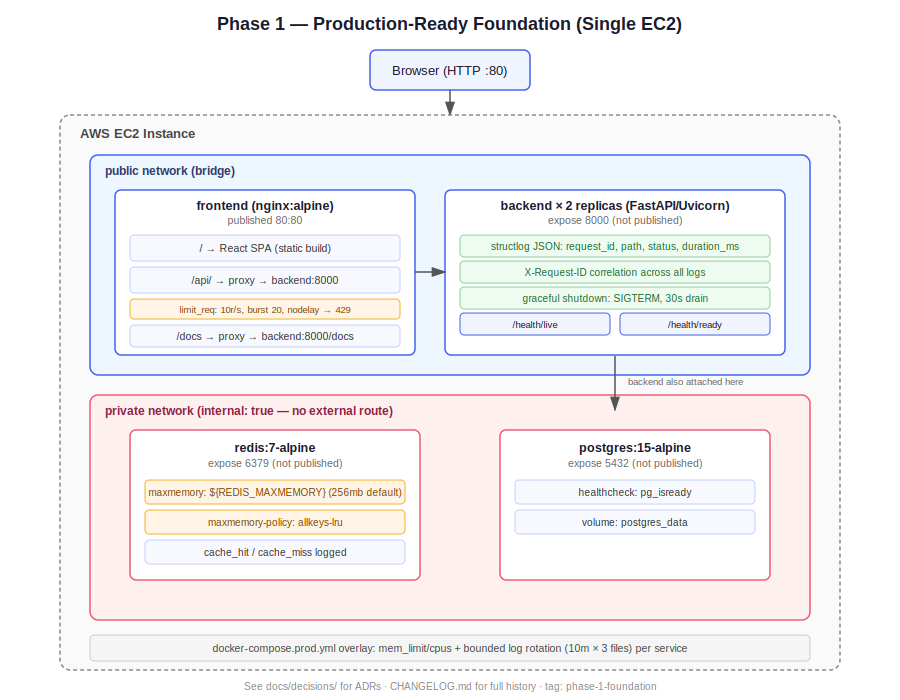

# URL Shortener

A production-grade URL shortener built in phases to demonstrate
backend engineering fundamentals — observability, scalability,
and reliability on AWS.

## Roadmap

| Phase | Focus                          | Status      | Tag                  |
|-------|---------------------------------|-------------|-----------------------|
| 0     | Baseline monolith on EC2        | ✅ Done      | `phase-0-baseline`    |
| 1     | Production-ready foundation     | ✅ Done   |       `phase-1-foundation`                |
| 2     | Observability                   | ⏳ Planned   | —                      |
| 3     | AWS managed services            | ⏳ Planned   | —                      |
| 4     | Load testing                    | ⏳ Planned   | —                      |

## Project Structure

- `backend/` — FastAPI application (Python)
- `frontend/` — React interface
- `docker-compose.yml` — Local development (one command setup)
- `.env.example` — Template for all required environment variables
- `docs/architecture/` — Architecture diagrams, one per phase
- `docs/decisions/` — [Architecture Decision Records](docs/decisions/) explaining key tradeoffs

## Quick Start

Prerequisites: Docker and Docker Compose installed.

```bash
cp .env.example .env
docker compose up
```

Then open `http://localhost` in your browser.

See `.env.example` for all required variables (database, Redis, CORS, feature flags).

## Running in prod-like mode locally
```bash
docker compose -f docker-compose.yml -f docker-compose.prod.yml up -d --build
```

Applies resource limits (mem_limit/cpus) and bounded log rotation
(max 10MB × 3 files per container), approximating the target EC2
instance's constraints — useful for catching resource-starvation or
log-growth issues.

## AWS EC2 Deployment

### Prerequisites
- EC2 instance running Ubuntu, with Docker and Docker Compose installed
- Security Group inbound rules: port 80 (HTTP) and port 22 (SSH) open

### Steps

1. Clone the repo and check out the tag you want to deploy:
   ```bash
   git clone <repo-url>
   cd url-shortener
   git checkout phase-0-baseline
   ```

2. Some Ubuntu AMIs ship with Apache pre-installed and bound to port 80,
   which will conflict with the frontend container. Check and disable it:
   ```bash
   sudo lsof -i :80
   sudo systemctl stop apache2 && sudo systemctl disable apache2   # if present
   ```

3. Copy the env template and fill in your EC2 public IP:
   ```bash
   cp .env.example .env
   # set BASE_URL, FRONTEND_BASE_URL, API_BASE_URL to http://<EC2_PUBLIC_IP>
   # set CORS_ORIGINS to include http://<EC2_PUBLIC_IP>
   ```

4. Enable memory overcommit for Redis background saves:
   ```bash
   sudo sysctl vm.overcommit_memory=1
   echo 'vm.overcommit_memory = 1' | sudo tee -a /etc/sysctl.conf
   ```

5. Build and start:
   ```bash
   docker compose up --build -d
   ```

6. Verify:
   ```bash
   docker compose ps                       # all services should show "Up"
   curl http://<EC2_PUBLIC_IP>/api/docs    # should return the FastAPI docs page
   ```

6. Open `http://<EC2_PUBLIC_IP>` in a browser.

## Architecture Evolution

This project is being built in 4 phases.

### Phase 0: Baseline Architecture



#### Known Limitations
- Nginx and the React build share one container (will separate in a later phase)
- No network segmentation — Redis/Postgres share the app's Docker network (Phase 1)
- Single EC2 instance — no redundancy at the infra level (Phase 3)

### Phase 1: Production-Ready Foundation



#### Known Limitations
- Nginx and the React build share one container
- Single EC2 instance — no redundancy at the infra level
- App-layer rate limiting, though unused, is broken if multiple backend replicas are deployed.
- docker-compose.prod.yml resource limit values are placeholders. To be updated after load testing.

## Architecture Decisions

Key technical tradeoffs are documented as ADRs in [`docs/decisions/`](docs/decisions/).

## License

MIT