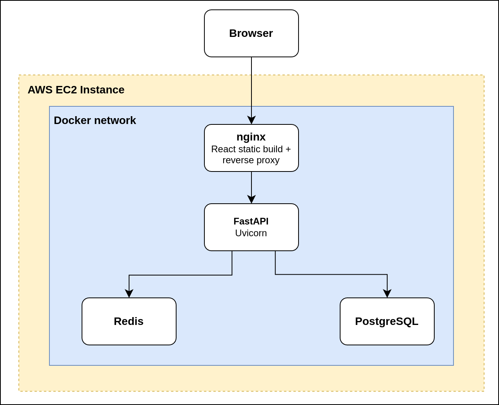
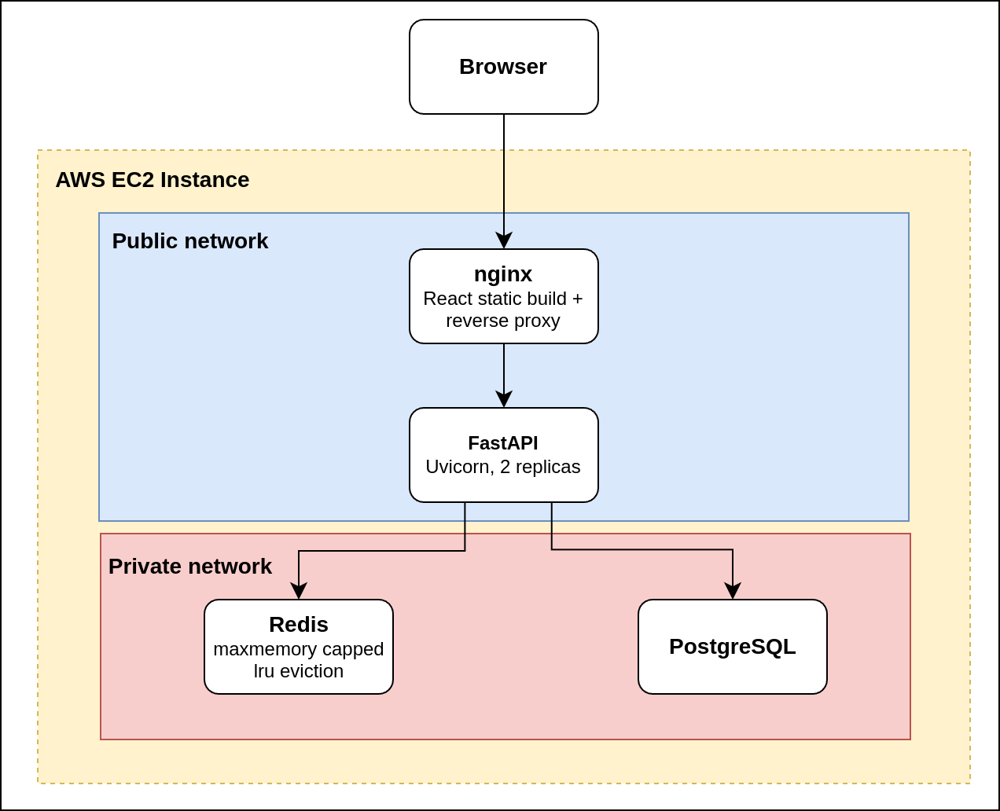
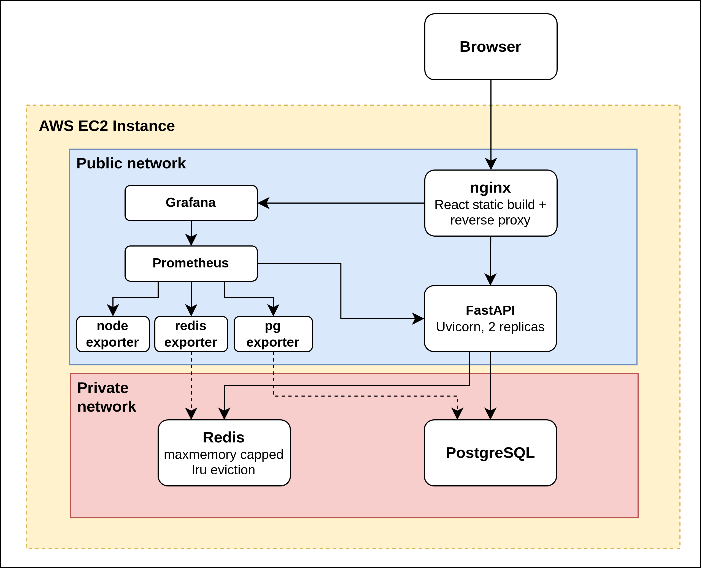

# URL Shortener

A production-grade URL shortener built in phases to demonstrate
backend engineering fundamentals — observability, scalability,
and reliability on AWS.

## Roadmap

| Phase | Focus                          | Status      | Tag                  |
|-------|---------------------------------|-------------|-----------------------|
| 0     | Baseline monolith on EC2        | ✅ Done      | `phase-0-baseline`    |
| 1     | Production-ready foundation     | ✅ Done   |       `phase-1-foundation`                |
| 2     | Observability                   | ✅ Done   |       `phase-2-observability`                |
| 3     | AWS managed services            | ⏳ Planned   | —                      |
| 4     | Load testing                    | ⏳ Planned   | —                      |

## Project Structure

- `backend/` — FastAPI application (Python)
- `frontend/` — React interface
- `docker-compose.yml` — Local development (one command setup)
- `.env.example` — Template for all required environment variables
- `docs/architecture/` — Architecture diagrams, one per phase
- `docs/decisions/` — [Architecture Decision Records](docs/decisions/) explaining key tradeoffs

## Quick Start

Prerequisites: Docker and Docker Compose installed.

```bash
cp .env.example .env
docker compose up
```

Then open `http://localhost` in your browser.

See `.env.example` for all required variables (database, Redis, CORS, feature flags).

## Running in prod-like mode locally
```bash
docker compose -f docker-compose.yml -f docker-compose.prod.yml up -d --build
```

Applies resource limits (mem_limit/cpus) and bounded log rotation
(max 10MB × 3 files per container), approximating the target EC2
instance's constraints — useful for catching resource-starvation or
log-growth issues.

## AWS EC2 Deployment

### Prerequisites
- EC2 instance running Ubuntu, with Docker and Docker Compose installed.
  **t3.small (2GB) minimum recommended** as t3.micro (1GB) was found to
  hit host-level OOM under the Phase 2 observability stack's load
  testing (Prometheus + Grafana + 3 exporters add real memory pressure
  on top of the app itself); confirmed via dmesg correlated against
  the test window
- Security Group inbound rules: port 80 (HTTP) and port 22 (SSH) open

### Steps

1. Clone the repo and check out the tag you want to deploy:
   ```bash
   git clone <repo-url>
   cd url-shortener
   git checkout phase-2-observability
   ```

2. Some Ubuntu AMIs ship with Apache pre-installed and bound to port 80,
   which will conflict with the frontend container. Check and disable it:
   ```bash
   sudo lsof -i :80
   sudo systemctl stop apache2 && sudo systemctl disable apache2   # if present
   ```

3. Copy the env template and fill in your EC2 public IP:
   ```bash
   cp .env.example .env
   # set BASE_URL, FRONTEND_BASE_URL, API_BASE_URL to http://<EC2_PUBLIC_IP>
   # set CORS_ORIGINS to include http://<EC2_PUBLIC_IP>
   ```

4. Generate the nginx basic-auth file that gates Grafana:
   ```bash
   sudo apt-get update && sudo apt-get install -y apache2-utils
   htpasswd -c frontend/.htpasswd admin
   ```
   This step must be repeated on every fresh EC2 instance; 
   it will not come from `git pull` as `frontend/.htpasswd` is gitignored.

5. Enable memory overcommit for Redis background saves:
   ```bash
   sudo sysctl vm.overcommit_memory=1
   echo 'vm.overcommit_memory = 1' | sudo tee -a /etc/sysctl.conf
   ```

6. Build and start:
   ```bash
   docker compose up --build -d
   ```

7. Enable `pg_stat_statements` for query-performance metrics (one-time
   per fresh database volume. It is required for the Database Health
   dashboard's slow-query panel; `postgres_exporter` will log
   `relation "pg_stat_statements" does not exist` until this is run):
   ```bash
   docker compose exec postgres env | grep POSTGRES   # confirm actual user/db values
   docker compose exec postgres psql -U <actual_user> -d <actual_db> \
     -c "CREATE EXTENSION IF NOT EXISTS pg_stat_statements;"
   docker compose restart postgres_exporter
   ```
   Use the literal values from the `env` check above, not shell
   variables like `${POSTGRES_USER}` — those are only auto-exported
   inside the container via `env_file`, not in your interactive shell,
   and silently expand to empty/default values otherwise.

8. Verify:
   ```bash
   docker compose ps                       # all services should show "Up"
   curl http://<EC2_PUBLIC_IP>/api/docs    # should return the FastAPI docs page
   curl -i http://<EC2_PUBLIC_IP>/grafana/            # should return 401 (basic auth required)
   curl -i -u admin:<password> http://<EC2_PUBLIC_IP>/grafana/   # should return 200
   ```

9. Open `http://<EC2_PUBLIC_IP>` in a browser, and
   `http://<EC2_PUBLIC_IP>/grafana/` for dashboards (basic-auth
   prompt, then Grafana login).

### Notes
- Do not open ports 9090 (Prometheus) or 3000 (Grafana) in the
  Security Group as both are reachable only through nginx on port 80,
  by design. To inspect Prometheus's `/targets` page directly, use an
  SSH tunnel instead of opening a port:
```bash
  ssh -L 9090:localhost:9090 ec2-user@<ec2-public-ip>
```
  then browse `http://localhost:9090/targets` locally.

## Architecture Evolution

This project is being built in 4 phases.

### Phase 0: Baseline Architecture



#### Known Limitations
- Nginx and the React build share one container (will separate in a later phase)
- No network segmentation — Redis/Postgres share the app's Docker network (Phase 1)
- Single EC2 instance — no redundancy at the infra level (Phase 3)

### Phase 1: Production-Ready Foundation



#### Known Limitations
- Nginx and the React build share one container
- Single EC2 instance — no redundancy at the infra level
- App-layer rate limiting, though unused, is broken if multiple backend replicas are deployed.
- docker-compose.prod.yml resource limit values are placeholders. To be updated after load testing.

### Phase 2: Observability



#### Known Limitations
- Nginx and the React build still share one container
- Single EC2 instance — no redundancy at the infra level (Phase 3)
- Slowest Queries dashboard shows queryid only, not query text due to
  exporter version limitation
- docker-compose.prod.yml resource limit values (including the new
  observability containers) are still placeholders pending Phase 4's
  real load-test numbers
- t3.small confirmed sufficient for Phase 2's light/moderate load
  testing; not yet validated under Phase 4's heavier load scenarios

## Architecture Decisions

Key technical tradeoffs are documented as ADRs in [`docs/decisions/`](docs/decisions/).

## License

MIT